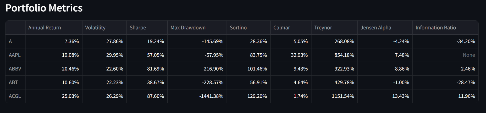
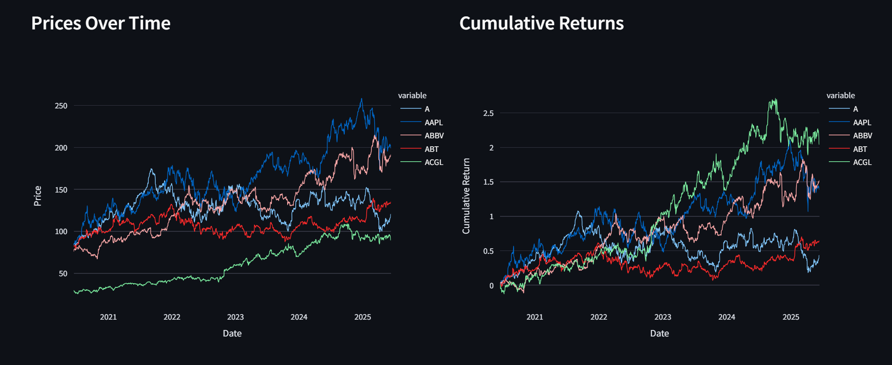
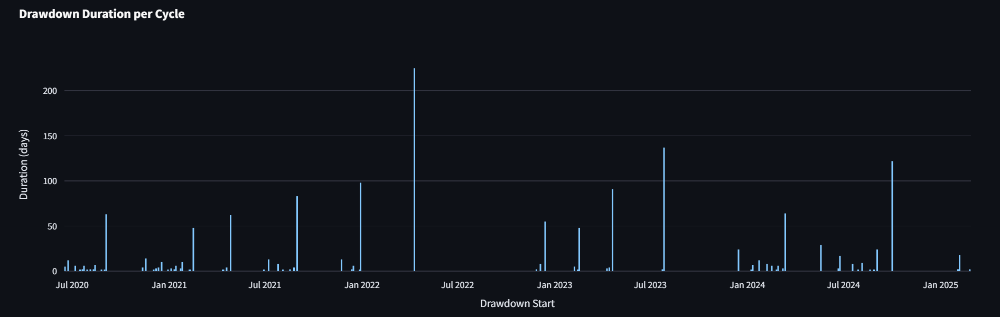
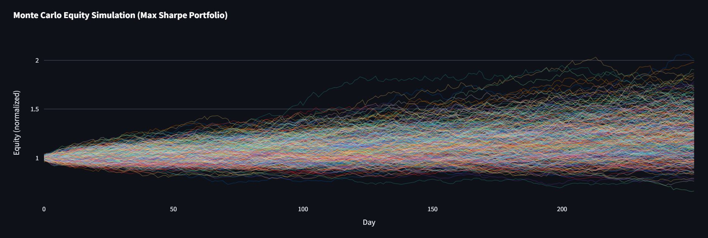
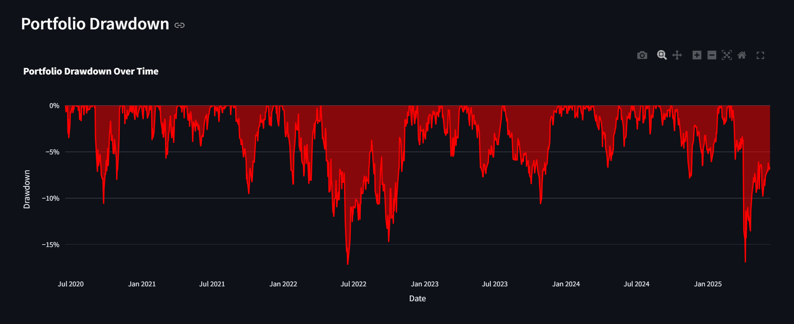
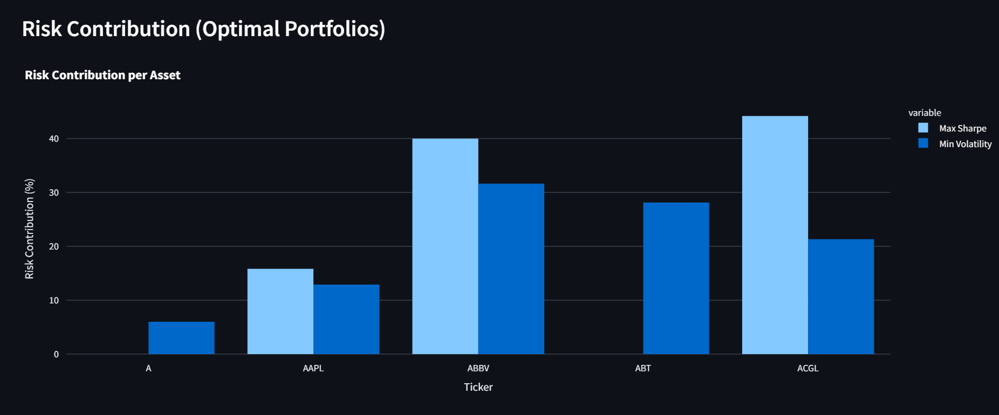
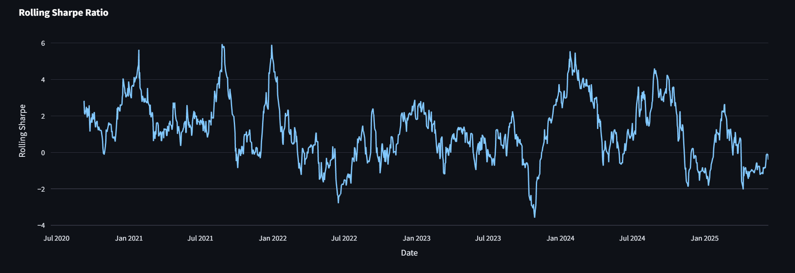
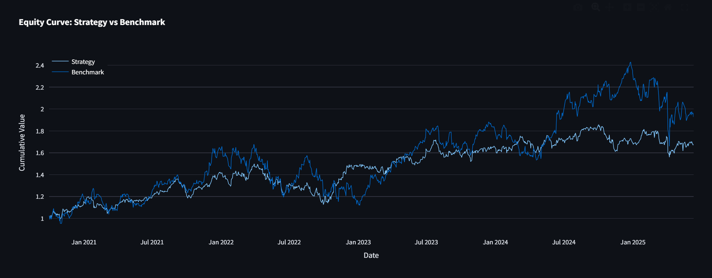
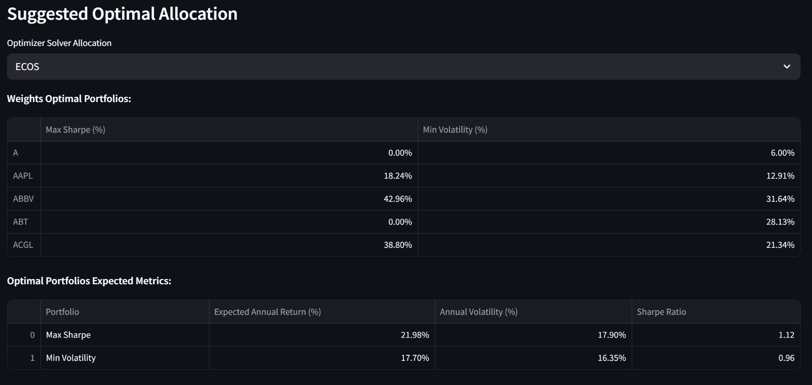
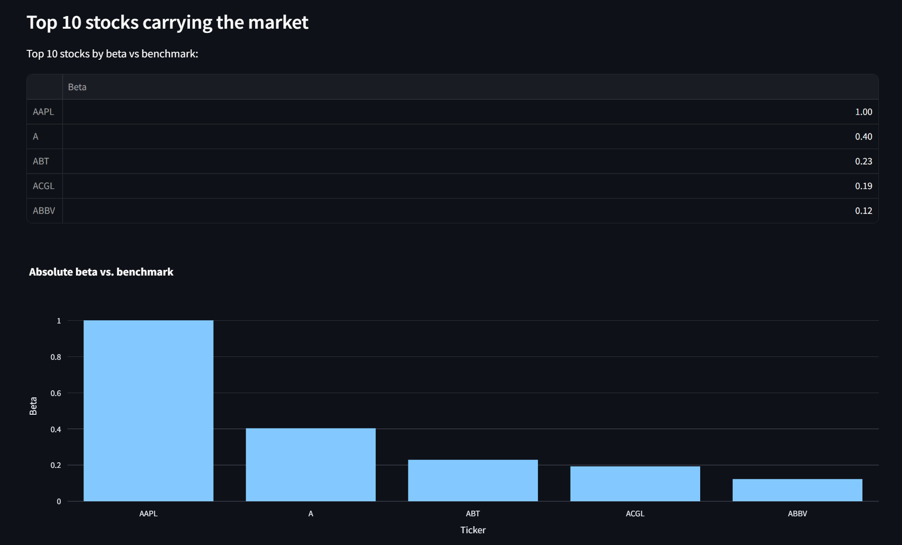

# Portfolio Analytics Dashboard

A lightweight and interactive Streamlit app to analyze, backtest, and optimize investment portfolios using advanced financial metrics and visualizations.

This Streamlit application provides an interactive dashboard for portfolio analytics, risk analysis, visualization, backtesting, and optimization. It integrates various financial metrics and methodologies to help investors and analysts explore and optimize their portfolios.

## Features

- **Data Import & Configuration**: Load price data from CSV, specify date range, tickers, and benchmark.
- **Portfolio Metrics**: Calculate annualized return, volatility, Sharpe ratio, Sortino ratio, Calmar ratio, Treynor ratio, Jensen's Alpha, Maximum Drawdown, and Information Ratio.
- **Risk Analysis**:
  - Rolling Volatility
  - Portfolio Drawdown
- **Visualizations**:
  - Price series
  - Cumulative returns
  - Correlation heatmap of returns
- **Value at Risk (VaR) / CVaR**:
  - Historical, Parametric Normal, Parametric t-distribution, Monte Carlo methods
- **Backtesting**: Momentum strategy backtest vs. benchmark
- **Custom Portfolio**:
  - Manual weight allocation
  - Partial optimization with fixed weight
  - Suggested optimal allocation (efficient frontier)
  - Risk contribution per asset
  - Drawdown duration analysis
- **Optimization & Simulation**:
  - Efficient frontier (Max Sharpe & Min Volatility)
  - Monte Carlo simulation of equity curves

## Installation

1. Clone this repository:
   ```bash
   git clone https://github.com/yourusername/portfolio-analytics-dashboard.git
   cd portfolio-analytics-dashboard
   ```
2. Create and activate a virtual environment (optional but recommended):
   ```bash
   python -m venv venv
   source venv/bin/activate  # Linux/macOS
   venv\Scripts\activate   # Windows
   ```
3. Install dependencies:
   ```bash
   pip install -r requirements.txt
   ```

## Usage

1. Place your historical price CSV file in `data/processed/` (default path: `data/processed/sp500_price.csv`).
2. Run the Streamlit app:
   ```bash
   streamlit run src/dashboard.py
   ```
3. Use the sidebar in the **Configuration** tab to:
   - Specify CSV path
   - Set risk-free rate, investment amount
   - Choose date range, tickers, and benchmark
   - Configure VaR/CVaR and backtest settings
4. Navigate through tabs to view metrics, risk analysis, visualizations, optimization, and simulations.

## Screenshots

Below are sample screenshots showcasing key visualizations in the dashboard:

- 
- 
- 
- 
- 
- 
- 
- 
- 
- 
  
## Project Structure

```
├── src/
│   ├── dashboard.py         # Main Streamlit application
│   ├── metrics.py           # Functions for financial metrics
│   ├── risk.py              # VaR/CVaR calculations
│   ├── backtest.py          # Backtesting logic for momentum strategy
│   └── optimization.py      # Efficient frontier computation
├── data/
│   └── processed/
│       └── sp500_price.csv  # Example price dataset
├── requirements.txt         # Python dependencies
└── README.md                # Project documentation
```

## Dependencies

- Python 3.10+
- streamlit
- pandas
- numpy
- plotly
- scikit-learn (for optimization modules if needed)
- PyPortfolioOpt

## Contributing

Contributions are welcome! Please open issues or submit pull requests for enhancements and bug fixes.

## License

This project is licensed under the Apache-2.0 License. See the [LICENSE](LICENSE) file for details.

